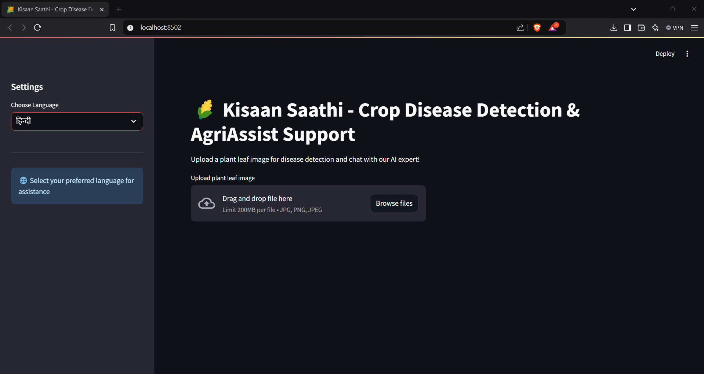
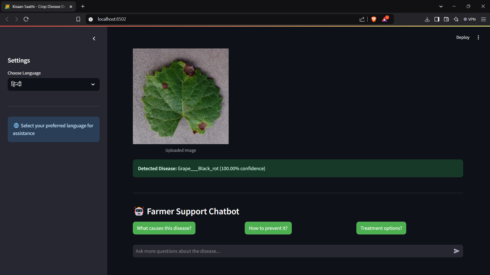
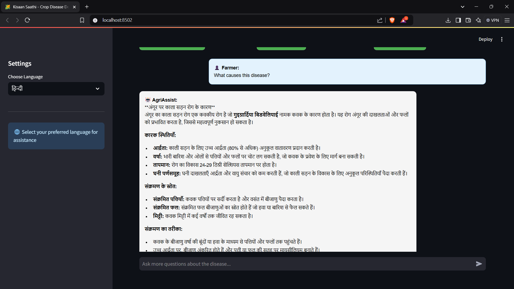

# Crop Disease Detection & AgriAssist Support

## Overview
This is a comprehensive solution aimed at empowering farmers with advanced crop disease detection and personalized assistance. The project is divided into two main components:

1. **Crop Disease Detection Model**
2. **Streamlit Web Application with AgriAssist Chatbot**

---

## Crop Disease Detection Model

### Dataset
- **Dataset Used**: [PlantVillage Dataset](https://www.kaggle.com/datasets/abdallahalidev/plantvillage-dataset)
- The dataset contains images of crops categorized into 38 different disease classes.

### Model Details
- **Architecture**: Pretrained Xception model
- **Training Approach**:
  - Used ImageDataGenerator for augmenting the training dataset.
  - Validation and test datasets were not augmented.
- **Optimization**:
  - Initially trained the model with frozen layers.
  - Improved accuracy by unfreezing layers for fine-tuning.

### Metrics and Performance
- **Initial Metrics**:
  - **Training Accuracy**: 98.78%
  - **Validation Accuracy**: 99.14%
  - **Test Accuracy**: 99.05%
  - Generated a confusion matrix.
  - Analyzed metrics: Precision, Recall, F1-Score, and Support.
- **Final Accuracy**:
  - **Training Accuracy**: 99.81%
  - **Validation Accuracy**: 99.69%
  - **Test Accuracy**: 99.72%
- **Final Metrics**:
  - Confusion matrix and analysis of Precision, Recall, F1-Score, and Support were performed again after fine-tuning.

---

## Streamlit Web Application with AgriAssist Chatbot

### Features
1. **Integration with the Crop Disease Detection Model**:
   - Users can upload crop images to detect diseases.
   - Displays the predicted disease along with confidence scores.

2. **AgriAssist Chatbot**:
   - Powered by the Gemini-Pro model through the Gemini API.
   - Multilingual support for better farmer accessibility:
     - **Languages Supported**: Hindi, English, Kannada, Punjabi
   - Provides detailed insights on:
     - Cause of the detected disease  
     - Prevention measures  
     - Treatment solutions  
---
### Docker Integration
To enhance the portability and scalability of the application, Docker has been utilized to package the entire application into a containerized environment. 

#### Steps to Build and Run the Docker Image
1. **Dockerfile**:
   - A `Dockerfile` has been created that includes all necessary instructions to containerize the Streamlit application.
   - It specifies the base image, installs dependencies, copies the application code, and sets the command to run the Streamlit app.

2. **Build the Docker Image**:
   Run the following command to build the Docker image locally:
   ```bash
   docker build -t kisaan-saathi-image:v1.0 .
   ```

3. **Pull the Prebuilt Docker Image**:
   The Docker image has been prebuilt and pushed to Docker Hub for easy access. You can pull it directly using:
   ```bash
   docker pull 21laksh/kisaan-saathi-image:v1.0
   ```

4. **Run the Docker Container**:
   Use the following command to start the application in a container:
   ```bash
   docker run -p 8501:8501 21laksh/kisaan-saathi-image:v1.0
   ```
   - This will expose the application on `http://localhost:8501`.
   - The containerized environment ensures consistent performance across different systems.

---

## Project Structure
```
App/
│── main.py               # Streamlit-web Application
│── class_indices.json    # All possible classes that can be predicted 
│── config.json           # Contains the Gemini API Key  
│── trained_model/
│   ├── plant_disease_prediction.h5  # Model file
│── requirements.txt      # List of Python dependencies
│── Dockerfile            # Docker instructions for containerizing the app
│── config.toml           # Default Streamlit Configurations
│── credentials.toml      # Stores credentials for Streamlit's advanced features like authentication
```

Please download the `plant_disease_prediction.h5` file through this drive link:  
[Download Model File](https://drive.google.com/file/d/1PqrcW3zoCfQlyKB58uXOBpxUKvtO0rSh/view?usp=sharing)

---
Access the Docker Repository directly:  
[Docker Repository Image](https://hub.docker.com/repository/docker/21laksh/kisaan-saathi-image/general)

---


## Screenshots




### How It Works
1. **Upload an Image**: Farmers or users can upload a crop image to the web application.
2. **Disease Detection**: The application classifies the disease using the pretrained Xception model.
3. **AgriAssist Assistance**:
   - Choose between the predefined questions or use a custom prompt in any one of the listed languages.  

---

## How to Run

1. **Clone the Repository**:
   ```bash
   git clone https://github.com/21lakshh/Kisaan-Saathi.git
   ```

2. **Install Dependencies**:
   ```bash
   pip install -r requirements.txt
   ```

3. **Run the Application**:
   ```bash
   streamlit run main.py
   ```

---

## Contributing
We welcome contributions! Feel free to open issues or submit pull requests.

---

## Acknowledgments
- [PlantVillage Dataset](https://www.kaggle.com/datasets/abdallahalidev/plantvillage-dataset) for providing the dataset.
- Gemini API for enabling advanced AI functionalities.
- Docker for providing a robust containerized solution for deployment.
